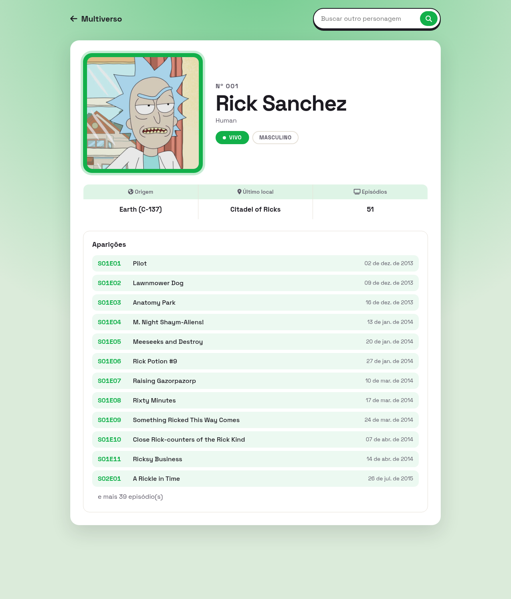

# Multiverso

Busca um personagem de Rick and Morty pelo nome ou número e monta a ficha com dados da [Rick and Morty API](https://rickandmortyapi.com/documentation).

Busca por número abre a ficha direto. Busca por nome lista os resultados, ou abre a ficha se só tiver um.

Cada ficha faz duas requisições:

1. `/character/{id}`: foto, status, espécie, gênero, origem e último local
2. `/episode/{ids}`: os primeiros 12 episódios em que o personagem aparece

A cor da página muda com o status: verde vivo, vermelho morto, cinza desconhecido.

Abre o `index.html` com internet ligada. Não precisa instalar nada.
